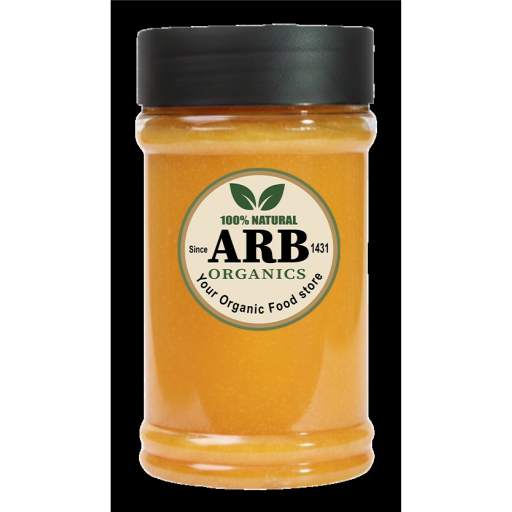
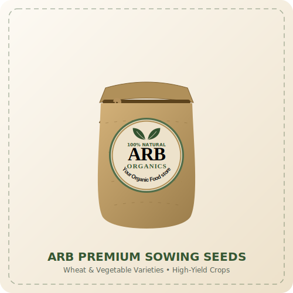
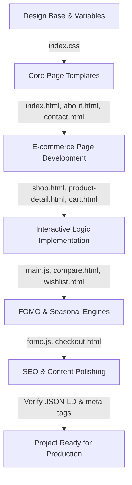

# ARB Farms: Modern Ecommerce Implementation Plan
*An SEO, AEO, and GEO-Optimized Agricultural & Organic E-commerce Strategy for Pakistan*

---

> [!NOTE]
> This document details the architectural blueprint, visual design tokens, search strategy, and interactive features for the ARB Farms e-commerce website. The system is designed to run on a performant, static-first front-end using **HTML5**, **Bootstrap 5.3**, and **Vanilla CSS** to maximize page speed and visibility for both traditional search engines (SEO) and modern AI answer engines (AEO/GEO).

---

## 1. Brand Identity & Design System

Analyzing the `arbfarms.com logo.png` file, we extracted a warm, premium, and agricultural-themed color palette that blends farm heritage with modern organic aesthetics.

### Color Palette (extracted from logo)
*   **Primary Brand Accent:** Deep Forest Green (`#365733`) — represents nature, growth, and organic agriculture.
*   **Secondary Brand Accent:** Warm Wheat Gold / Bronze (`#b5925e`) — represents harvest, grains, quality, and premium quality.
*   **Neutral Warm Base:** Alabaster Cream (`#ede1ca` / `#f8f6f0`) — a softer, warmer alternative to stark white, giving an organic, tactile feel.
*   **Deep Contrast Typography:** Charcoal Spruce (`#121912`) — off-black with a hint of dark forest green for readable, high-contrast typography.

### Typography
*   **Headers:** `Outfit` (Google Fonts) — a geometric, friendly sans-serif that feels clean and modern.
*   **Body Text:** `Inter` (Google Fonts) — highly readable across mobile and desktop screens.
*   **Accents/Trust Badges:** `Lora` (Google Fonts) — a beautiful serif to emphasize heritage, farm stories, and testimonials.

### CSS Design Tokens (`index.css`)
```css
:root {
  /* Brand Colors */
  --color-primary: #365733;
  --color-primary-hover: #263d24;
  --color-secondary: #b5925e;
  --color-secondary-hover: #9c7b4c;
  --color-accent: #ede1ca;
  --color-accent-light: #fdfaf4;
  
  /* Neutral Palette */
  --color-bg-page: #f8f6f0;
  --color-text-dark: #121912;
  --color-text-muted: #5a6459;
  --color-white: #ffffff;
  --color-border: #e2ded5;
  
  /* System States */
  --color-success: #28a745;
  --color-warning: #ffc107;
  --color-danger: #dc3545;
  
  /* Shadows & Radius */
  --shadow-sm: 0 2px 4px rgba(18, 25, 18, 0.04);
  --shadow-md: 0 4px 12px rgba(18, 25, 18, 0.08);
  --shadow-lg: 0 10px 30px rgba(18, 25, 18, 0.12);
  --radius-sm: 6px;
  --radius-md: 12px;
  --radius-lg: 20px;
  
  /* Transitions */
  --transition-smooth: all 0.3s cubic-bezier(0.4, 0, 0.2, 1);
}
```

---

## 2. Market & Competitor Benchmarking (Pakistan)

The target audience spans two core customer profiles:
1.  **D2C Consumers (Organic Foods):** Urban households seeking pure staples (desi ghee, honey, oils, grains).
2.  **B2B / Micro-Farmers (Agricultural Inputs):** Gardeners and farmers buying high-quality sowing seeds and animal feed.

### Core Competitors Analysis

| Competitor | Focus Area | Strengths | Opportunities for ARB Farms |
| :--- | :--- | :--- | :--- |
| **Himalayan Chef** | Premium Groceries | High brand recognition, excellent packaging, wide distribution. | Differentiate via farm-to-table traceability, off-grid philosophy, and custom organic certifications. |
| **Khalis Food Company** | Pure Staples (Ghee/Honey) | Strong consumer trust, focus on raw/pure ingredients. | Compete with direct farm transparency (vlogs/photos of the Multan farm) and clean, responsive UI. |
| **BaKhabar Kissan (bkk.ag)** | Agri-advisory & Seeds | Strong mobile utility, agricultural advice, weather integration. | Create a simpler, visually superior retail/gardening seed buying experience with micro-details. |
| **Agri Store (agristore.pk)** | Seed & Fertilizer Marketplace | Large selection of hybrid seeds, commercial inputs. | Offer a curated, high-end organic seed selection with superior UX, side-by-side comparisons, and premium customer service. |

---

## 3. SEO, AEO, and GEO Optimization Strategy

To secure maximum visibility across Google search, AI engines (Gemini, ChatGPT, Perplexity), and geographic location-based search engines, we will deploy a multi-layered optimization matrix.

### SEO (Search Engine Optimization)
*   **Semantic Heading Hierarchy:** Strictly structured HTML5 elements (`<header>`, `<main>`, `<article>`, `<footer>`). A single, keyword-optimized `<h1>` per page.
*   **Page Speed / Core Web Vitals:** Lightweight Bootstrap 5.3, vanilla CSS, responsive `.webp` or compressed `.jpeg` images (lazy-loaded), and zero render-blocking scripts.
*   **Microdata integration:** Microdata embedded directly in the markup to assist web crawlers in building relational databases.

### AEO (Answer Engine Optimization) & GEO (Generative Engine Optimization)
AI chat assistants and LLMs rely on structured, clear, and direct answers to pull citations. We achieve this by embedding structured JSON-LD schemas inside the page header scripts:

#### A. Homepage JSON-LD Schema (`LocalBusiness`)
```json
{
  "@context": "https://schema.org",
  "@type": "LocalBusiness",
  "name": "ARB Farms",
  "image": "https://arbfarms.com/logo.png",
  "logo": "https://arbfarms.com/logo.png",
  "url": "https://arbfarms.com",
  "telephone": "+923200005367",
  "priceRange": "$$",
  "address": {
    "@type": "PostalAddress",
    "streetAddress": "ARB Farms, Street 1, Fatima Avenue, Opp. Fatima Masjid, Near Prime Mart. MPS Road",
    "addressLocality": "Multan",
    "addressRegion": "Punjab",
    "postalCode": "60000",
    "addressCountry": "PK"
  },
  "geo": {
    "@type": "GeoCoordinates",
    "latitude": "30.1575",
    "longitude": "71.5249"
  },
  "openingHoursSpecification": {
    "@type": "OpeningHoursSpecification",
    "dayOfWeek": [
      "Monday",
      "Tuesday",
      "Wednesday",
      "Thursday",
      "Friday",
      "Saturday"
    ],
    "opens": "09:00",
    "closes": "18:00"
  },
  "sameAs": [
    "https://www.youtube.com/@ARBFARMS",
    "https://www.instagram.com/arbfarms"
  ]
}
```

#### B. Product Detail JSON-LD Schema
```json
{
  "@context": "https://schema.org/",
  "@type": "Product",
  "name": "ARB Premium Organic Desi Ghee",
  "image": "https://arbfarms.com/catalog/organic-desi-ghee.svg",
  "description": "Pure grass-fed organic Desi Ghee sourced from Multan, Pakistan. Prepared traditional way with zero preservatives.",
  "brand": {
    "@type": "Brand",
    "name": "ARB Farms"
  },
  "offers": {
    "@type": "Offer",
    "url": "https://arbfarms.com/product/organic-desi-ghee.html",
    "priceCurrency": "PKR",
    "price": "2450",
    "priceValidUntil": "2027-12-31",
    "itemCondition": "https://schema.org/NewCondition",
    "availability": "https://schema.org/InStock",
    "shippingDetails": {
      "@type": "OfferShippingDetails",
      "shippingRate": {
        "@type": "MonetaryAmount",
        "value": "200",
        "currency": "PKR"
      },
      "shippingDestination": {
        "@type": "DefinedRegion",
        "addressCountry": "PK"
      },
      "deliveryTime": {
        "@type": "ShippingDeliveryTime",
        "handlingTime": {
          "@type": "QuantitativeValue",
          "minValue": 0,
          "maxValue": 1,
          "unitCode": "DAY"
        },
        "transitTime": {
          "@type": "QuantitativeValue",
          "minValue": 2,
          "maxValue": 4,
          "unitCode": "DAY"
        }
      }
    }
  }
}
```

#### C. FAQPage JSON-LD Schema
```json
{
  "@context": "https://schema.org",
  "@type": "FAQPage",
  "mainEntity": [
    {
      "@type": "Question",
      "name": "Does ARB Farms deliver COD across Pakistan?",
      "acceptedAnswer": {
        "@type": "Answer",
        "text": "Yes, we deliver Cash on Delivery (COD) all over Pakistan, including Lahore, Karachi, Islamabad, Multan, and rural areas, within 2 to 4 working days."
      }
    },
    {
      "@type": "Question",
      "name": "Are ARB Farms seeds hybrid or organic?",
      "acceptedAnswer": {
        "@type": "Answer",
        "text": "We offer both premium non-GMO organic sowing seeds and F1 high-yield hybrid agricultural inputs. Check individual product descriptions for specific seed types."
      }
    }
  ]
}
```

---

## 4. Pakistan Agricultural & Holiday Campaign Matrix

To coordinate our e-commerce dynamics and FOMO messages, we utilize a year-round crop cycle and cultural calendar targeted specifically at Pakistan's demographics.

| Month Range | Holiday/Season | Primary Focus Products | Targeted FOMO Banner Copy | Action Call-to-Action |
| :--- | :--- | :--- | :--- | :--- |
| **Dec – Feb** | Winter Solstice | Sidr Honey, Desi Ghee, Cold-pressed Oils, Chia Seeds | ❄️ Winter Wellness: Warm up with cold-pressed Oils and Raw Honey. Buy the Winter Bundle now! | Save 10% on Winter Staples |
| **Mar – Apr** | Ramadan prep & Eid | Desi Ghee, Honey, Edible Seeds | 🌙 Ramadan Prep: Fuel your Sehri & Iftar with pure Organic Honey & Desi Ghee. Order before courier shutdown! | Order Eid Sweets Ghee |
| **Apr – May** | Basant / Spring Sowing | Vegetable Sowing Seeds, Organic Fertilizer | 🌱 Spring Garden Rush: Sow tomato, chili, and okra seeds now. High germination rates guaranteed. | Get Garden Pack |
| **Jun – Aug** | Multan Mango Season | Fresh Organic Chaunsa Mangoes | 🥭 Fresh Multan Chaunsa Mangoes pre-orders are 85% full! Harvest begins next week. | Pre-order Mango Basket |
| **Aug** | Independence Day | Storewide Products | 🇵🇰 Jashn-e-Azadi Special! Flat 14% Off across all organic foods and agricultural seeds. | Shop Independence Sale |
| **Oct – Nov** | Rabi Sowing Cycle | High-Yield Wheat Seeds, Berseem Fodder Seeds, Animal Feed | 🌾 Rabi Crop Alert: High-germination Wheat and Fodder Seeds are selling fast. Secure your yield! | Order Rabi Farming Seeds |
| **Nov – Dec** | Kharif Harvesting / Crop Feeds | High-Protein Dairy Wanda, Silage Feeds | 🐄 Livestock Nutrition: Keep milk yields high during winter transition. Stock up on Dairy Wanda! | Order Animal Feed Bags |

---

## 5. Site Architecture & Page Directories

```
organic-website/
├── index.html                  # Homepage (Core overview, categories, hero banner, SEO tags)
├── about.html                  # About Us (ARB Farms philosophy, farm-to-table story)
├── contact.html                # Contact Us (Enquiry form, map, WhatsApp link)
├── shop.html                   # Shop Catalog (Product grid, sidebar filters, search, wishlist toggle)
├── compare.html                # Product Comparison (Side-by-side specs, prices, buy links)
├── wishlist.html               # Wishlist Page (Saved items grid, easy add-to-cart)
├── product/
│   ├── organic-desi-ghee.html   # Sample Product Detail (AEO-optimized, JSON-LD, reviews)
│   ├── sowing-seeds.html        # Sample Seed Product (Agri specs, sowing guide table)
│   ├── feed-agri.html          # Feed Product (Livestock feeding instructions, ingredients)
│   └── edible-seeds.html        # Edible Seed Product (Nutritional facts, recipes)
├── cart.html                   # Cart Review Page (Subtotals, delivery estimator)
├── checkout.html               # Checkout Page (One-page COD, city dropdown, contact info)
├── thank-you.html              # Thank You / Order Confirmation (Dynamic summary, delivery tracking info)
├── legal/
│   ├── privacy-policy.html     # Privacy Policy (Data protection, cookie info)
│   ├── terms-conditions.html   # Terms and Conditions (Sales terms, usage terms)
│   ├── shipping-policy.html    # Shipping & Delivery (COD limits, cities list, timelines)
│   └── refund-policy.html      # Return & Refund Policy (Claims process, return addresses)
├── css/
│   └── index.css               # Premium design tokens, custom components, utility classes
└── js/
│   ├── main.js                 # Cart logic, catalog filter, comparison, wishlist, search
│   └── fomo.js                 # Dynamic Location & Holiday-based FOMO engine
```

---

## 6. Page Templates & Semantic Code Snippets

### A. Semantic Product Card with Microdata Schema
This card represents the standard item configuration shown on `shop.html`, complete with styling utilities from Bootstrap 5.3 and custom brand attributes.
```html
<div class="col-md-4 col-sm-6 mb-4">
  <div class="card h-100 product-card border-0 shadow-sm" itemscope itemtype="https://schema.org/Product">
    <!-- Badges -->
    <span class="badge position-absolute m-3 bg-secondary text-white z-2">Bestseller</span>
    <button class="wishlist-btn position-absolute top-0 end-0 m-3 border-0 bg-transparent text-muted z-2" aria-label="Add to Wishlist" data-id="101">
      <i class="bi bi-heart-fill"></i>
    </button>
    
    <!-- Image Wrapper -->
    <div class="product-img-wrapper overflow-hidden bg-light position-relative">
      
      <div class="product-action-overlay d-flex justify-content-center align-items-center gap-2 position-absolute w-100 h-100 top-0 start-0">
        <a href="product/organic-desi-ghee.html" class="btn btn-light btn-sm"><i class="bi bi-eye"></i> Quick View</a>
        <button class="btn btn-light btn-sm compare-btn" data-id="101" aria-label="Add to Compare"><i class="bi bi-shuffle"></i></button>
      </div>
    </div>
    
    <!-- Content Body -->
    <div class="card-body d-flex flex-column p-4">
      <span class="text-uppercase text-muted small font-weight-bold" itemprop="category">Organic Foods</span>
      <h3 class="card-title h5 my-2 text-dark font-primary" itemprop="name">ARB Premium Organic Desi Ghee</h3>
      
      <!-- Micro-review structure -->
      <div class="d-flex align-items-center mb-2" itemprop="aggregateRating" itemscope itemtype="https://schema.org/AggregateRating">
        <div class="text-warning small me-2">
          <i class="bi bi-star-fill"></i><i class="bi bi-star-fill"></i><i class="bi bi-star-fill"></i><i class="bi bi-star-fill"></i><i class="bi bi-star-fill"></i>
        </div>
        <span class="text-muted small">(<span itemprop="ratingCount">42</span> reviews)</span>
        <meta itemprop="ratingValue" content="5.0">
      </div>
      
      <p class="card-text text-muted small text-truncate-2" itemprop="description">Sourced from pasture raised buffaloes in South Punjab, processed manually.</p>
      
      <!-- Price & Cart CTA -->
      <div class="mt-auto d-flex justify-content-between align-items-center pt-3 border-top" itemprop="offers" itemscope itemtype="https://schema.org/Offer">
        <div>
          <span class="text-decoration-line-through text-muted small">Rs. 2,800</span>
          <span class="text-primary font-weight-bold h5 mb-0 d-block">Rs. <span itemprop="price">2,450</span></span>
          <meta itemprop="priceCurrency" content="PKR">
          <link itemprop="availability" href="https://schema.org/InStock">
        </div>
        <button class="btn btn-primary add-to-cart-btn" data-id="101" data-name="Organic Desi Ghee" data-price="2450">
          <i class="bi bi-cart-plus"></i> Add
        </button>
      </div>
    </div>
  </div>
</div>
```

### B. Product Comparison Layout Blueprint (`compare.html`)
A dedicated comparison page allows farmers and gardeners to review seed specs or nutritional feeds side by side.
```html
<div class="table-responsive shadow-sm border rounded-3 bg-white">
  <table class="table table-bordered text-center align-middle mb-0">
    <thead class="table-light">
      <tr>
        <th class="text-start" style="width: 25%;">Product Details</th>
        <th style="width: 37.5%;">
          <div class="position-relative p-2">
            
            <h6>Rabi Sowing Wheat Seeds</h6>
            <span class="text-primary font-weight-bold">Rs. 4,500 / Bag</span>
          </div>
        </th>
        <th style="width: 37.5%;">
          <div class="position-relative p-2">
            
            <h6>Standard Sowing Wheat Seeds</h6>
            <span class="text-primary font-weight-bold">Rs. 3,800 / Bag</span>
          </div>
        </th>
      </tr>
    </thead>
    <tbody>
      <tr>
        <td class="text-start font-weight-bold">Purity Level</td>
        <td>99.2% (Premium)</td>
        <td>97.5% (Standard)</td>
      </tr>
      <tr>
        <td class="text-start font-weight-bold">Germination Rate</td>
        <td>92% Minimum</td>
        <td>85% Minimum</td>
      </tr>
      <tr>
        <td class="text-start font-weight-bold">Yield Capacity</td>
        <td>45-50 Maunds / Acre</td>
        <td>38-42 Maunds / Acre</td>
      </tr>
      <tr>
        <td class="text-start font-weight-bold">Recommended Soil</td>
        <td>Loam / Clay Loam</td>
        <td>Sandy Loam / Loam</td>
      </tr>
      <tr>
        <td class="text-start font-weight-bold">Actions</td>
        <td>
          <button class="btn btn-primary btn-sm w-100 add-to-cart-btn" data-id="201">Add to Cart</button>
        </td>
        <td>
          <button class="btn btn-outline-primary btn-sm w-100 add-to-cart-btn" data-id="202">Add to Cart</button>
        </td>
      </tr>
    </tbody>
  </table>
</div>
```

---

## 7. Pakistani Courier & Payment Integration Strategy

To properly support commerce in Pakistan, we configure the checkout workflow to support local courier partners and standard payment networks.

### Cash on Delivery (COD) API Workflows
1.  **Shipping Provider Matrix:**
    *   **TCS / Leopards Courier:** Best coverage for national shipping.
    *   **Rider / BlueEx:** Advanced API integrations, ideal for urban shipping (Lahore, Karachi, Islamabad).
2.  **API Integration Details:**
    *   *Shipping Rates Engine:* Integrated into `cart.js`. Shipping charges are calculated dynamically based on total order weight according to the ARB Organics pricing guidelines:
        *   **Weight Up to 5 kg:** Rs. 300 / kg
        *   **Weight Above 6 kg (6kg to 39.9kg):** Rs. 150 / kg
        *   **Weight Above 1 Maund (40 kg and above):** Rs. 1,500 / Maund (1 Maund = 40 kg)
    *   *Automated Booking:* When checkout is submitted, JavaScript transmits the payload to our shipping middleware which books the consignment and generates a tracking number immediately.

### Payment Gateways (Digital & Local card settlement)
To secure non-COD orders, we propose three routes depending on the developer's scale:

```
[Customer Checkout]
        │
        ├──► Cash on Delivery (COD) ➔ Auto-books through TCS/Leopards Courier API
        │
        ├──► Digital Wallets ➔ EasyPaisa / JazzCash Web Checkout Redirect APIs
        │
        └──► Card Settlement ➔ PayFast / Safepay / Nayapay Hosted Checkout Page
```

1.  **Hosted Redirect (PayFast / Safepay):**
    *   Simplest implementation for Visa/Mastercard. Generates a secure checkout link containing transaction ID, amount, and returns the customer to `thank-you.html` with a success/fail hash query.
2.  **Digital Wallets (EasyPaisa / JazzCash APIs):**
    *   Integrates direct mobile account payments. The user types their mobile number, gets an OTP prompt on their phone, confirms with their PIN, and transaction completes securely.

---

## 8. Dynamic Seasonal & Localized FOMO Engine

To build consumer trust and create dynamic urgency, we propose a modular JavaScript file `fomo.js`. This engine generates contextual popups and banners based on the user's local timeline, regional Pakistani hubs, and agricultural/cultural seasons.

### Key Logic & Triggers
1.  **Location-Based Social Proof:** Popups at the bottom-left showing simulated, historically accurate purchases from specific Pakistani cities (e.g., *"Zahid from Multan purchased 10kg Sowing Seeds 5 mins ago"*).
2.  **Holiday & Crop Sowing Banner Dynamics:** A top-bar announcement banner that updates dynamically based on the current calendar date.

```javascript
/**
 * fomo.js - Dynamic Urgent Notifications & Seasonal Banner Engine
 * ARB Farms E-commerce
 */

// 1. Pakistani Cities for localized social proof
const pakistaniCities = [
  "Karachi, Sindh", "Lahore, Punjab", "Islamabad, Capital", "Rawalpindi, Punjab",
  "Faisalabad, Punjab", "Multan, Punjab", "Peshawar, KPK", "Quetta, Balochistan",
  "Sialkot, Punjab", "Gujranwala, Punjab", "Hyderabad, Sindh", "Sargodha, Punjab"
];

// 2. ARB Farms Products matching workspace images
const products = [
  { name: "Organic Desi Ghee", image: "catalog/organic-desi-ghee.svg" },
  { name: "Premium Sowing Seeds (Wheat/Veg)", image: "catalog/sowing-seeds.svg" },
  { name: "High-Nutrient Agri Feed", image: "catalog/feed-agri.svg" },
  { name: "Edible Chia & Flax Seeds", image: "catalog/edible-seeds.svg" }
];

// 3. Holiday / Sowing Season Calendar Database
const seasonalCampaigns = [
  {
    name: "Ramadan Prep",
    startMonth: 2, // March (approximate calendar shifting)
    endMonth: 3,   // April
    bannerText: "🌙 Ramadan Special: Fuel your Sehri & Iftar with pure Organic Honey & Desi Ghee. Order early to avoid courier delays!",
    discountCode: "RAMADANKHALIS"
  },
  {
    name: "Mango Season Pre-Order",
    startMonth: 4, // May
    endMonth: 7,   // August
    bannerText: "🥭 Multan Organic Mangoes Pre-orders are open! Direct farm-to-table delivery starts soon.",
    discountCode: "MANGO2026"
  },
  {
    name: "Rabi Sowing Cycle (Wheat/Fodder)",
    startMonth: 9, // October
    endMonth: 10,  // November
    bannerText: "🌾 Rabi Sowing Season Alert! High-germination Wheat and Fodder Seeds are selling fast. Secure your yield!",
    discountCode: "RABIDEAL"
  },
  {
    name: "Kharif Sowing Cycle (Cotton/Rice/Feed)",
    startMonth: 3, // April
    endMonth: 5,   // June
    bannerText: "🌱 Kharif Crop Alert: Premium seeds & Livestock Feed inputs ready for dispatch.",
    discountCode: "KHARIFAGRI"
  },
  {
    name: "Peak Winter Health",
    startMonth: 11, // December
    endMonth: 1,    // February
    bannerText: "❄️ Winter Wellness: Warm up with cold-pressed Oils and Raw Honey. Flat 10% off using code WINTERPURE.",
    discountCode: "WINTERPURE"
  },
  {
    name: "Independence Day Sale",
    startMonth: 7, // August 1st
    endMonth: 7,   // August 15th (Trigger only in mid-August)
    bannerText: "🇵🇰 Jashn-e-Azadi Special! Flat 14% Off across all organic foods and seeds until August 14th.",
    discountCode: "AZADI14"
  }
];

// Default Campaign if no holiday matches
const defaultCampaign = {
  bannerText: "📦 Cash on Delivery (COD) available all over Pakistan. Free delivery on orders above Rs. 3,000!",
  discountCode: "ARBFRESH"
};

// Initialize FOMO Engine
document.addEventListener("DOMContentLoaded", () => {
  setupSeasonalBanner();
  startSocialProofPopups();
});

// Setup Dynamic Top Banner
function setupSeasonalBanner() {
  const bannerEl = document.getElementById("fomo-announcement-banner");
  if (!bannerEl) return;
  
  const now = new Date();
  const currentMonth = now.getMonth(); // 0-indexed: Jan=0, Dec=11
  const currentDate = now.getDate();
  
  let activeCampaign = defaultCampaign;
  
  // Find matching campaign
  for (const campaign of seasonalCampaigns) {
    // Handling specific edge case for mid-month campaigns like Independence Day
    if (campaign.name === "Independence Day Sale") {
      if (currentMonth === 7 && currentDate <= 15) {
        activeCampaign = campaign;
        break;
      }
      continue;
    }
    
    // Normal seasonal month checks
    if (campaign.startMonth <= campaign.endMonth) {
      if (currentMonth >= campaign.startMonth && currentMonth <= campaign.endMonth) {
        activeCampaign = campaign;
        break;
      }
    } else {
      // Overlapping year-end (e.g. Dec-Feb)
      if (currentMonth >= campaign.startMonth || currentMonth <= campaign.endMonth) {
        activeCampaign = campaign;
        break;
      }
    }
  }
  
  bannerEl.innerHTML = `
    <div class="container text-center py-2 text-white font-weight-bold d-flex justify-content-center align-items-center gap-3">
      <span>${activeCampaign.bannerText}</span>
      <span class="badge bg-white text-dark ms-2">Code: ${activeCampaign.discountCode}</span>
    </div>
  `;
}

// Start Popup Cycle
function startSocialProofPopups() {
  // Create Popup Container in Body
  const popupContainer = document.createElement("div");
  popupContainer.id = "fomo-popup-container";
  popupContainer.style.position = "fixed";
  popupContainer.style.bottom = "20px";
  popupContainer.style.left = "20px";
  popupContainer.style.zIndex = "9999";
  popupContainer.style.maxWidth = "350px";
  popupContainer.style.transition = "transform 0.5s ease, opacity 0.5s ease";
  popupContainer.style.opacity = "0";
  popupContainer.style.transform = "translateY(50px)";
  document.body.appendChild(popupContainer);
  
  // Trigger popup every 15-25 seconds
  showRandomNotification(popupContainer);
  setInterval(() => {
    showRandomNotification(popupContainer);
  }, Math.random() * (25000 - 15000) + 15000);
}

function showRandomNotification(container) {
  // Clear any active notification first
  container.style.opacity = "0";
  container.style.transform = "translateY(50px)";
  
  setTimeout(() => {
    const randomCity = pakistaniCities[Math.floor(Math.random() * pakistaniCities.length)];
    const randomProduct = products[Math.floor(Math.random() * products.length)];
    const randomMinutes = Math.floor(Math.random() * 58) + 2;
    const randomQty = Math.floor(Math.random() * 4) + 1;
    
    // Check if the file is in parent workspace folder, adjust path accordingly
    const imagePath = `/${randomProduct.image}`;
    
    container.innerHTML = `
      <div class="card border-0 shadow-lg" style="background-color: var(--color-accent-light, #fdfaf4); border-left: 5px solid var(--color-primary, #365733) !important; border-radius: var(--radius-md, 12px);">
        <div class="card-body p-3 d-flex align-items-center gap-3">
          
          <div>
            <p class="mb-0 text-dark" style="font-size: 0.85rem; font-weight: 600;">Someone in <span style="color: var(--color-primary, #365733);">${randomCity}</span></p>
            <p class="mb-1 text-dark" style="font-size: 0.8rem; font-weight: 500;">ordered <span style="font-weight: 700;">${randomQty}x ${randomProduct.name}</span></p>
            <span class="text-muted" style="font-size: 0.7rem; display: block;"><i class="bi bi-clock-history"></i> ${randomMinutes} minutes ago &bull; Verified Order</span>
          </div>
          <button type="button" class="btn-close ms-auto align-self-start" style="font-size: 0.7rem;" onclick="this.closest('#fomo-popup-container').style.opacity = '0';"></button>
        </div>
      </div>
    `;
    
    // Slide in
    container.style.opacity = "1";
    container.style.transform = "translateY(0)";
    
    // Slide out after 7 seconds
    setTimeout(() => {
      container.style.opacity = "0";
      container.style.transform = "translateY(50px)";
    }, 7000);
    
  }, 500);
}
```

---

## 9. Next Steps & Execution Workflow

Once you approve this architecture, we will implement it step-by-step:



---

## 10. ARB Organics Product Catalogs & Price Lists
*Effective Date: 9 May 2026*

### A. Edible Seed Catalog
The following table represents the complete list of edible seed products (Superfood & Dietary Supplements) for retail consumption:

| SKU | Product Name | Weight | Price (PKR) | Sowing / Usage Category |
| :--- | :--- | :--- | :--- | :--- |
| **OGN-018** | Gandum (Wheat) | 40 Kg | Rs. 9,000 | Grain / Sowing / Staple |
| **OGN-027** | Kalonji (Black Seed) | 250 gm | Rs. 720 | Superfood / Spice |
| **OGN-046** | Kalonji (Black Seed) | 500 gm | Rs. 1,350 | Superfood / Spice |
| **OGN-028** | Chia Seed | 250 gm | Rs. 1,400 | Superfood / Fiber |
| **OGN-048** | Chia Seed | 500 gm | Rs. 2,700 | Superfood / Fiber |
| **OGN-063** | Isapghol | 100 gm | Rs. 1,400 | Dietary Fiber / Herb |
| **OGN-064** | Isapghol | 250 gm | Rs. 2,700 | Dietary Fiber / Herb |
| **OGN-053** | Moringa Powder | 250 gm | Rs. 1,400 | Herbal Supplement |
| **OGN-054** | Moringa Powder | 500 gm | Rs. 2,700 | Herbal Supplement |
| **OGN-055** | Flax Seed | 250 gm | Rs. 720 | Superfood / Omega-3 |
| **OGN-056** | Flax Seed | 500 gm | Rs. 1,350 | Superfood / Omega-3 |
| **OGN-057** | Sunflower Seed | 250 gm | Rs. 720 | Edible Seed / Snack |
| **OGN-058** | Sunflower Seed | 500 gm | Rs. 1,350 | Edible Seed / Snack |
| **OGN-059** | Sesame Seed | 250 gm | Rs. 720 | Edible Seed / Spice |
| **OGN-060** | Sesame Seed | 500 gm | Rs. 1,350 | Edible Seed / Spice |
| **OGN-051** | Basil Seed (Tukh Malanga) | 250 gm | Rs. 720 | Cooling Seed / Beverage |
| **OGN-061** | Basil Seed (Tukh Malanga) | 500 gm | Rs. 1,350 | Cooling Seed / Beverage |
| **OGN-052** | Pumpkin Seed | 250 gm | Rs. 1,400 | Premium Snack Seed |
| **OGN-053** | Pumpkin Seed | 500 gm | Rs. 2,700 | Premium Snack Seed |

### B. Dairy & Organic Food Catalog
The following table represents the list of fresh dairy products and value-added organic items:

| SKU | Product Name | Weight | Price (PKR) | Sowing / Usage Category |
| :--- | :--- | :--- | :--- | :--- |
| **OGN-004** | Cow Milk | 1 Ltr | Rs. 330 | Fresh Dairy (Multan Only) |
| **OGN-005** | Buffalo Milk | 1 Ltr | Rs. 390 | Fresh Dairy (Multan Only) |
| **OGN-006** | Goat Milk | 1 Ltr | Rs. 1,000 | Fresh Dairy (Multan Only) |
| **OGN-007** | Desi Organic Gurr | 1 Kg | Rs. 720 | Organic Sweetener |
| **OGN-008** | Gurr with Dry Fruits | 1 Kg | Rs. 1,800 | Premium Sweetener |
| **OGN-009** | Organic Shakar | 1 Kg | Rs. 810 | Organic Sweetener |
| **OGN-010** | Organic Shakar | 6 Kg | Rs. 4,400 | Bulk Sweetener |
| **OGN-011** | Sidr Honey Small | 500 gm | Rs. 5,000 | Premium Honey |
| **OGN-012** | Sidr Honey Large | 1 Kg | Rs. 9,000 | Premium Honey |
| **OGN-013** | Desi Ghee | 500 gm | Rs. 5,000 | Organic Ghee / Dairy |
| **OGN-014** | Desi Ghee | 1 Kg | Rs. 9,000 | Organic Ghee / Dairy |
| **OGN-015** | Organic Achaar | 400 gm | Rs. 700 | Traditional Pickles |
| **OGN-016** | Organic Achaar | 750 gm | Rs. 1,000 | Traditional Pickles |
| **OGN-017** | Organic Achaar | 1 Kg | Rs. 1,400 | Traditional Pickles |

### C. Feed / Agri Catalog
The following table represents the list of bulk feed and agricultural crop products:

| SKU | Product Name | Weight | Price (PKR) | Sowing / Usage Category |
| :--- | :--- | :--- | :--- | :--- |
| **OGN-041** | Silage | 40 Kg | Rs. 900 | Animal Feed / Forage |
| **OGN-042** | Hay | 40 Kg | Rs. 5,400 | Animal Feed / Fodder |
| **OGN-044** | Toori (Wheat Straw) | 40 Kg | Rs. 1,100 | Animal Bedding / Roughage |

### Shipping Tiers Summary
*   **General (Non-Wheat) Products:**
    *   1g to 1000g: Rs. 300 flat rate
    *   1001g to 5999g: Rs. 300 per kg
    *   6000g and above: Rs. 150 per kg
*   **Wheat Products:**
    *   0.5g to 5999g: Rs. 300 per kg
    *   6000g to 40000g: Rs. 150 per kg
    *   40000g and above: Rs. 1,500 per Maund (40 kg)

---
