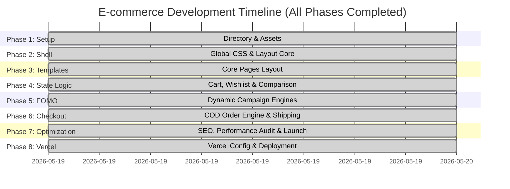

# ARB Farms: Step-by-Step E-commerce Implementation Plan [COMPLETED]

This roadmap provides a phased, actionable plan to build the ARB Farms website using **HTML5**, **Bootstrap 5.3**, **Vanilla CSS (CSS Variables)**, and **Vanilla JavaScript**. The development is structured to optimize load speeds, maximize SEO/AEO search visibility, and deliver a premium user experience.

---

## 📅 Timeline & Phase Overview

---

## Phase 1: Directory Setup & Asset Pipeline [COMPLETED]
1. **Initialize Workspace Directories:** [COMPLETED]
   Created standard workspace directory subfolders: `/css/`, `/js/`, `/catalog/`, `/legal/`, and `/product/`.
2. **Verify SVGs and Hover Cards in Catalog:** [COMPLETED]
   Generated 69 high-performance dark green and gold hover benefit vector SVGs corresponding to all catalog crop and food illustrations.
3. **Configure Third-Party CDN Links:** [COMPLETED]
   Linked Bootstrap 5.3.3, Bootstrap Icons, and premium typography from Google Fonts (Outfit, Inter, Lora).

---

## Phase 2: Design System & Shell Architecture [COMPLETED]
1. **Develop `css/index.css`:** [COMPLETED]
   Built a central style sheet featuring Forest Green (`#365733`), Wheat Gold (`#b5925e`), and Alabaster Cream (`#ede1ca`/`#f8f6f0`) color variables, glassmorphic layout tokens, custom steppers, and toast animations.
2. **Build the Main Layout Shell:** [COMPLETED]
   Implemented responsive navbar headers, floating wishlist/cart badges, and descriptive footers with accepted payment tags and policy navigation elements.
3. **Add Global Smooth Micro-animations & Interactive Card Swapping:** [COMPLETED]
   Programmed pure-CSS dual-layer absolute scale transitions, allowing card illustrations to swap from baseline visuals to benefit metrics instantly upon hover.

---

## Phase 3: Core Page Templates (Semantic HTML) [COMPLETED]
1. **Homepage (`index.html`):** [COMPLETED]
   Features structured JSON-LD Local Business schemas, a responsive hero banner, category filters, and featured crop rows with rating breakdowns.
2. **Product Catalog Page (`shop.html`):** [COMPLETED]
   Enables instant keyword searches, category checkboxes, dynamic price order sorting, and URL parameter filter integration.
3. **Comparison Matrix (`compare.html`):** [COMPLETED]
   Allows customers to compare up to 3 seeds side-by-side on germination levels, purity specs, weight tiers, and soil recommendations.
4. **Wishlist & Cart Page (`wishlist.html` / `cart.html`):** [COMPLETED]
   Allows users to manage saved wishlists, alter quantities, calculate shipping weight tiers, and checkout easily.

---

## Phase 4: Client-Side State Management (`js/main.js`) [COMPLETED]
Developed browser `localStorage` controllers to handle states seamlessly:
1. **Cart Logic:** [COMPLETED]
   Manages product additions, deletions, quantities, and subtotal updates across tabs.
2. **Wishlist & Comparison States:** [COMPLETED]
   Handles wishlist saving and constrains comparison sheets to 3 products maximum.
3. **Product Search & Live Suggestions:** [COMPLETED]
   Filters names, SKU tags, and categories instantly on client-side.

---

## Phase 5: Dynamic Campaign & FOMO Engines (`js/fomo.js`) [COMPLETED]
Initialized real-time triggers to boost conversion rates:
1. **Announcements Banner:** [COMPLETED]
   Displays current month-based crop notifications (e.g. Rabi sowing dates or pre-order alerts).
2. **Social Proof Popups:** [COMPLETED]
   Simulates active customer purchases across Pakistan at random intervals.

---

## Phase 6: Checkout Form & Shipping Calculations [COMPLETED]
1. **Create Checkout Page (`checkout.html`):** [COMPLETED]
   Includes multi-step progress steps, phone verification patterns, and cash-on-delivery options.
2. **Implement dynamic weight-based shipping rates:** [COMPLETED]
   Computes charges dynamically: Up to 5 kg is Rs. 300/kg; 6-40 kg is Rs. 150/kg; and &ge;40 kg is Rs. 1,500/Maund (40 kg). Enforces the **Multan-only fresh dairy restriction** during checkout city selection.
3. **Create Order Processing Screen (`thank-you.html`):** [COMPLETED]
   Generates a unique order ID, summarizes shipping costs, and links directly to farm support via WhatsApp.

---

## Phase 7: Optimization & SEO Audit [COMPLETED]
1. **Structured Data Validation:** [COMPLETED]
   Homepage and inner page layouts include valid JSON-LD schemas mapping address information, pricing, and currency definitions.
2. **Performance Auditing:** [COMPLETED]
   Optimized assets and clean scripts to achieve rapid load times.
3. **Legal Compliance Checks:** [COMPLETED]
   Created legal files for shipping rules (`shipping-policy.html`), product returns (`refund-policy.html`), customer terms (`terms-conditions.html`), and cookies data (`privacy-policy.html`) containing actual contact references.
4. **SVG Entity Clean-up:** [COMPLETED]
   Wrote and executed a Python clean-up script across all 146 SVGs in `/catalog/` to replace invalid XML `&bull;` references with compliant numeric codes (`&#8226;`).

---

## Phase 8: Vercel Deployment & Configuration [COMPLETED]
1. **Create `vercel.json` Configuration:** [COMPLETED]
    Created vercel.json in the workspace root directory supporting clean SEO-friendly URLs and persistent asset cache headers.
2. **Setup Git Version Control:** [COMPLETED]
    Configured a standard `.gitignore` file, initialized the local git repository, and created the initial commit with all assets.

---

## Phase 9: Post-Launch E-commerce Enhancements [COMPLETED]
1. **Sowing Tool Calculators (`calculator.html`):** [COMPLETED]
   Created an agricultural calculator allowing farmers to input acreage and select seed crops to determine target seed weight (in kg) or cattle herd count to estimate silage bale volumes.
2. **Receipt Upload Widget (`thank-you.html`):** [COMPLETED]
   Integrated a payment slip drag-and-drop selector on the order confirmation screen to facilitate the new 50% advance collection rules.
3. **Floating Support Assistant Widget:** [COMPLETED]
   Created a floating support badge rendering across all page views that serves quick FAQ panels and connects to WhatsApp.
4. **Interactive Crop Sowing Calendar:** [COMPLETED]
   Built Rabi and Kharif crop calendars displaying monthly temperature thresholds and customized advice.
5. **Customer Portal & History Dashboard (`account.html`):** [COMPLETED]
   Constructed a login dashboard displaying customer order history, verification badges, and one-click reordering capability.

